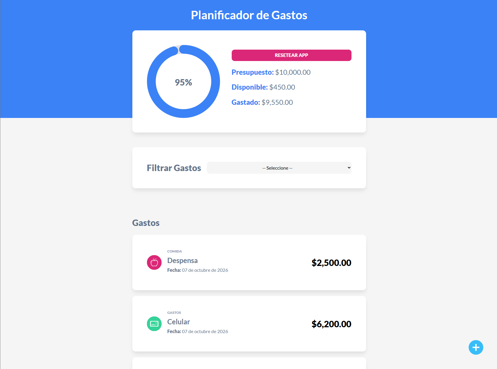

# 💰 Planificador de Gastos

Aplicación web sencilla para administrar un presupuesto personal. Defines cuánto dinero tienes disponible, registras tus gastos por categoría y la app te muestra en todo momento cuánto has gastado y cuánto te queda, con una gráfica circular del porcentaje utilizado.

Está construida con **Vue 3** y **Vite**, y guarda toda la información en el **LocalStorage** del navegador, por lo que no necesita backend ni base de datos.



## ✨ Características

- **Definir presupuesto** inicial, con validación para evitar valores vacíos o negativos.
- **Agregar, editar y eliminar gastos**, cada uno con nombre, cantidad, categoría y fecha.
- **Gráfica de progreso circular** que muestra el porcentaje del presupuesto ya utilizado.
- **Resumen en tiempo real** del presupuesto total, la cantidad disponible y lo gastado.
- **Control de presupuesto**: no permite registrar un gasto que exceda lo disponible (también al editar).
- **Filtro por categoría** para ver solo los gastos de un tipo.
- **Persistencia con LocalStorage**: los datos se conservan al recargar o cerrar el navegador.
- **Reiniciar la app** para borrar el presupuesto y todos los gastos.

### Categorías disponibles

Ahorro · Comida · Casa · Gastos varios · Ocio · Salud · Suscripciones

## 🛠️ Tecnologías

- [Vue 3](https://vuejs.org/) con Composition API y `<script setup>`
- [Vite](https://vitejs.dev/) como herramienta de desarrollo y build
- [vue3-circle-progress](https://www.npmjs.com/package/vue3-circle-progress) para la gráfica de progreso
- [Sass](https://sass-lang.com/)
- [Normalize.css](https://necolas.github.io/normalize.css/) y la fuente [Lato](https://fonts.google.com/specimen/Lato) de Google Fonts
- LocalStorage API del navegador

## 📋 Requisitos

- [Node.js](https://nodejs.org/) 16 o superior
- npm (incluido con Node.js)

## 🚀 Instalación y uso

1. Clona el repositorio:

   ```bash
   git clone https://github.com/TU_USUARIO/admin-gastos.git
   cd admin-gastos
   ```

2. Instala las dependencias:

   ```bash
   npm install
   ```

3. Inicia el servidor de desarrollo:

   ```bash
   npm run dev
   ```

4. Abre en tu navegador la URL que muestra la terminal (por defecto `http://localhost:5173`).

### Otros scripts

| Comando           | Descripción                                          |
| ----------------- | ---------------------------------------------------- |
| `npm run dev`     | Inicia el servidor de desarrollo con recarga en caliente |
| `npm run build`   | Genera la versión de producción en la carpeta `dist/` |
| `npm run preview` | Sirve localmente la versión de producción generada   |

## 📖 Cómo se usa

1. Escribe tu presupuesto inicial y presiona **Definir Presupuesto**.
2. Haz clic en el botón **+** de la esquina inferior derecha para añadir un gasto.
3. Completa el nombre, la cantidad y la categoría, y guarda.
4. Para editar o eliminar un gasto, haz clic sobre su nombre en el listado.
5. Usa el selector **Filtrar Gastos** para ver solo una categoría.
6. Con **Resetear App** puedes empezar de cero.

## 💾 Almacenamiento de datos

La app usa dos claves en el LocalStorage del navegador:

- `presupuesto`: el presupuesto definido.
- `gastos`: un arreglo en formato JSON con todos los gastos registrados.

Como los datos viven solo en el navegador, no se sincronizan entre dispositivos y se pierden si se borra el almacenamiento del sitio.
